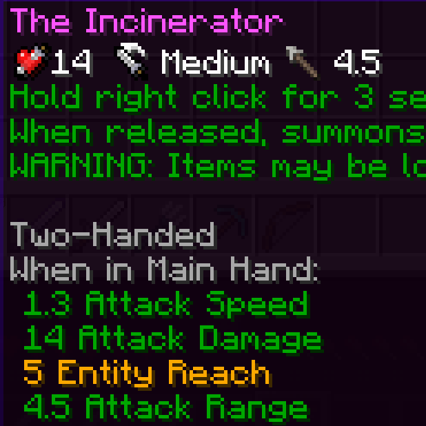

Modifies elements of the [Obscure API](https://www.curseforge.com/minecraft/mc-mods/obscure-api) library

# Tooltips
More items are supported in regards of showing icons:

Attack damage includes the `sharpness` enchant and `cold / fire damage` from [Apothic Attributes](https://www.curseforge.com/minecraft/mc-mods/apothic-attributes):

Attack range icon which uses [Better Combat](https://www.curseforge.com/minecraft/mc-mods/better-combat-by-daedelus) values, if present:

Harvest level icon for tools:

# Configuration
There is a client config to disable the `attack range` and `harvest level` icons

If some items are still missing icons they can be added to the `obscure_api_modification:force_tooltip` item tag
- If icons are still missing after that then there is probably nothing to show